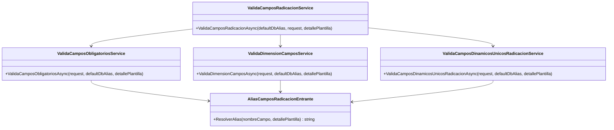

# Diagrama de Clases - SCRUM-50

```mermaid
classDiagram
    class AliasCamposRadicacionEntrante {
      +ResolverAlias(nombreCampo, detallePlantilla) string
    }

    class ValidaCamposObligatoriosService {
      +ValidaCamposObligatoriosAsync(request, defaultDbAlias, detallePlantilla)
    }

    class ValidaDimensionCamposService {
      +ValidaDimensionCamposAsync(request, defaultDbAlias, detallePlantilla)
    }

    class ValidaCamposDinamicosUnicosRadicacionService {
      +ValidaCamposDinamicosUnicosRadicacionAsync(request, defaultDbAlias, detallePlantilla)
    }

    class ValidaCamposRadicacionService {
      +ValidaCamposRadicacionAsync(defaultDbAlias, request, detallePlantilla)
    }

    ValidaCamposObligatoriosService --> AliasCamposRadicacionEntrante
    ValidaDimensionCamposService --> AliasCamposRadicacionEntrante
    ValidaCamposDinamicosUnicosRadicacionService --> AliasCamposRadicacionEntrante
    ValidaCamposRadicacionService --> ValidaCamposObligatoriosService
    ValidaCamposRadicacionService --> ValidaDimensionCamposService
    ValidaCamposRadicacionService --> ValidaCamposDinamicosUnicosRadicacionService
```
