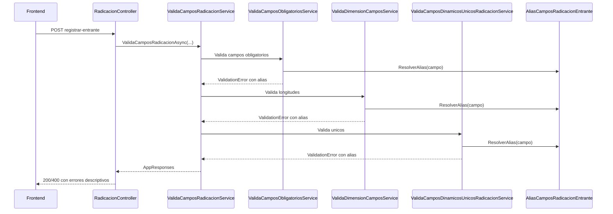

# Diagrama de Secuencia - SCRUM-50

```mermaid
sequenceDiagram
    participant FE as Frontend
    participant API as RadicacionController
    participant ORQ as ValidaCamposRadicacionService
    participant OBL as ValidaCamposObligatoriosService
    participant DIM as ValidaDimensionCamposService
    participant UNI as ValidaCamposDinamicosUnicosRadicacionService
    participant ALS as AliasCamposRadicacionEntrante

    FE->>API: POST registrar-entrante
    API->>ORQ: ValidaCamposRadicacionAsync(...)
    ORQ->>OBL: Valida campos obligatorios
    OBL->>ALS: ResolverAlias(campo)
    OBL-->>ORQ: ValidationError con alias
    ORQ->>DIM: Valida longitudes
    DIM->>ALS: ResolverAlias(campo)
    DIM-->>ORQ: ValidationError con alias
    ORQ->>UNI: Valida unicos
    UNI->>ALS: ResolverAlias(campo)
    UNI-->>ORQ: ValidationError con alias
    ORQ-->>API: AppResponses
    API-->>FE: 200/400 con errores descriptivos
```
