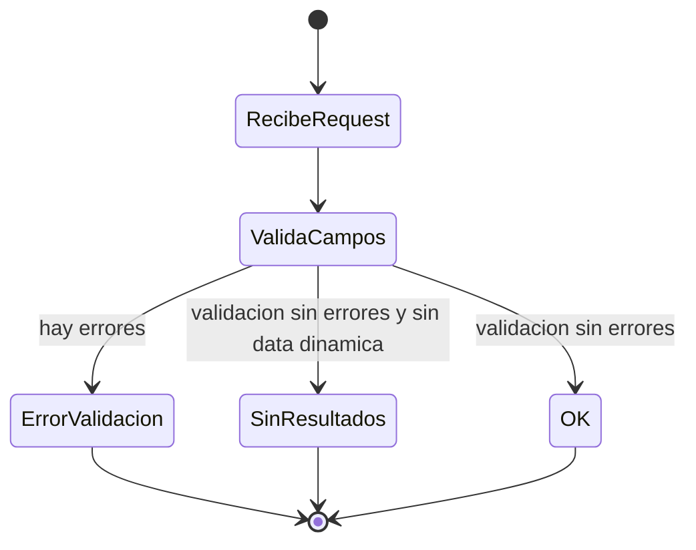

# Diagrama de Estado - SCRUM-50

```mermaid
stateDiagram-v2
    [*] --> RecibeRequest
    RecibeRequest --> ValidaCampos
    ValidaCampos --> ErrorValidacion: hay errores
    ValidaCampos --> SinResultados: validacion sin errores y sin data dinamica
    ValidaCampos --> OK: validacion sin errores
    ErrorValidacion --> [*]
    SinResultados --> [*]
    OK --> [*]
```
