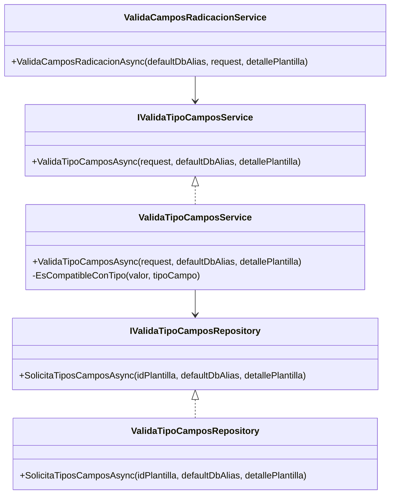

# Diagrama de Clases - SCRUM-51

```mermaid
classDiagram
    class IValidaTipoCamposRepository {
      +SolicitaTiposCamposAsync(idPlantilla, defaultDbAlias, detallePlantilla)
    }

    class ValidaTipoCamposRepository {
      +SolicitaTiposCamposAsync(idPlantilla, defaultDbAlias, detallePlantilla)
    }

    class IValidaTipoCamposService {
      +ValidaTipoCamposAsync(request, defaultDbAlias, detallePlantilla)
    }

    class ValidaTipoCamposService {
      +ValidaTipoCamposAsync(request, defaultDbAlias, detallePlantilla)
      -EsCompatibleConTipo(valor, tipoCampo)
    }

    class ValidaCamposRadicacionService {
      +ValidaCamposRadicacionAsync(defaultDbAlias, request, detallePlantilla)
    }

    IValidaTipoCamposRepository <|.. ValidaTipoCamposRepository
    IValidaTipoCamposService <|.. ValidaTipoCamposService
    ValidaTipoCamposService --> IValidaTipoCamposRepository
    ValidaCamposRadicacionService --> IValidaTipoCamposService
```
