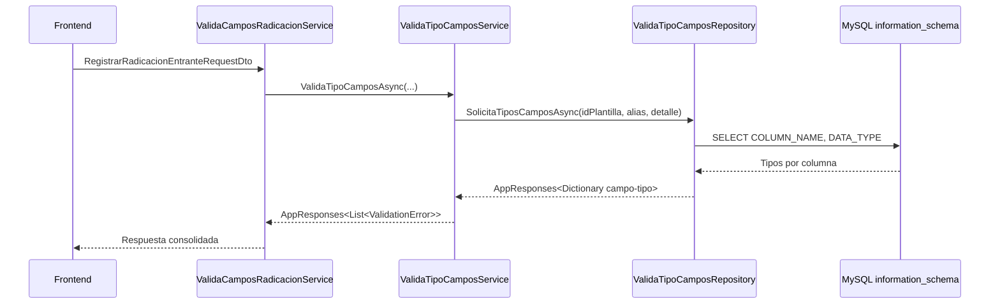

# Diagrama de Secuencia - SCRUM-51

```mermaid
sequenceDiagram
    participant FE as Frontend
    participant ORQ as ValidaCamposRadicacionService
    participant VAL as ValidaTipoCamposService
    participant REP as ValidaTipoCamposRepository
    participant DB as MySQL information_schema

    FE->>ORQ: RegistrarRadicacionEntranteRequestDto
    ORQ->>VAL: ValidaTipoCamposAsync(...)
    VAL->>REP: SolicitaTiposCamposAsync(idPlantilla, alias, detalle)
    REP->>DB: SELECT COLUMN_NAME, DATA_TYPE
    DB-->>REP: Tipos por columna
    REP-->>VAL: AppResponses<Dictionary campo-tipo>
    VAL-->>ORQ: AppResponses<List<ValidationError>>
    ORQ-->>FE: Respuesta consolidada
```
