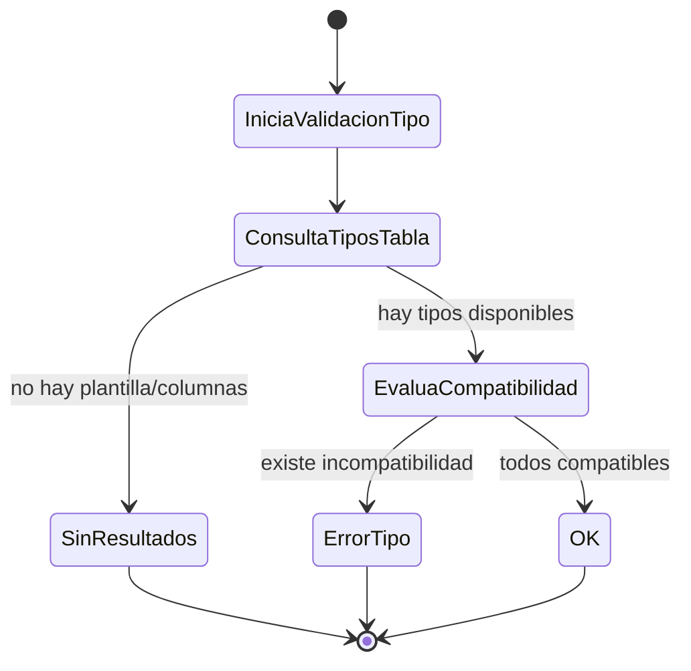

# Diagrama de Estado - SCRUM-51

```mermaid
stateDiagram-v2
    [*] --> IniciaValidacionTipo
    IniciaValidacionTipo --> ConsultaTiposTabla
    ConsultaTiposTabla --> SinResultados: no hay plantilla/columnas
    ConsultaTiposTabla --> EvaluaCompatibilidad: hay tipos disponibles
    EvaluaCompatibilidad --> ErrorTipo: existe incompatibilidad
    EvaluaCompatibilidad --> OK: todos compatibles
    SinResultados --> [*]
    ErrorTipo --> [*]
    OK --> [*]
```
