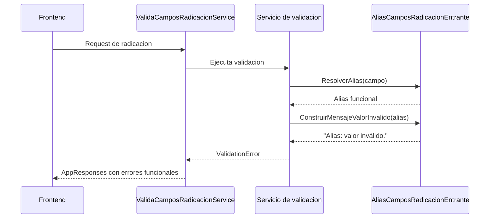

# Diagrama de Secuencia - SCRUM-52

```mermaid
sequenceDiagram
    participant FE as Frontend
    participant ORQ as ValidaCamposRadicacionService
    participant VAL as Servicio de validacion
    participant ALS as AliasCamposRadicacionEntrante

    FE->>ORQ: Request de radicacion
    ORQ->>VAL: Ejecuta validacion
    VAL->>ALS: ResolverAlias(campo)
    ALS-->>VAL: Alias funcional
    VAL->>ALS: ConstruirMensajeValorInvalido(alias)
    ALS-->>VAL: "Alias: valor inválido."
    VAL-->>ORQ: ValidationError
    ORQ-->>FE: AppResponses con errores funcionales
```
