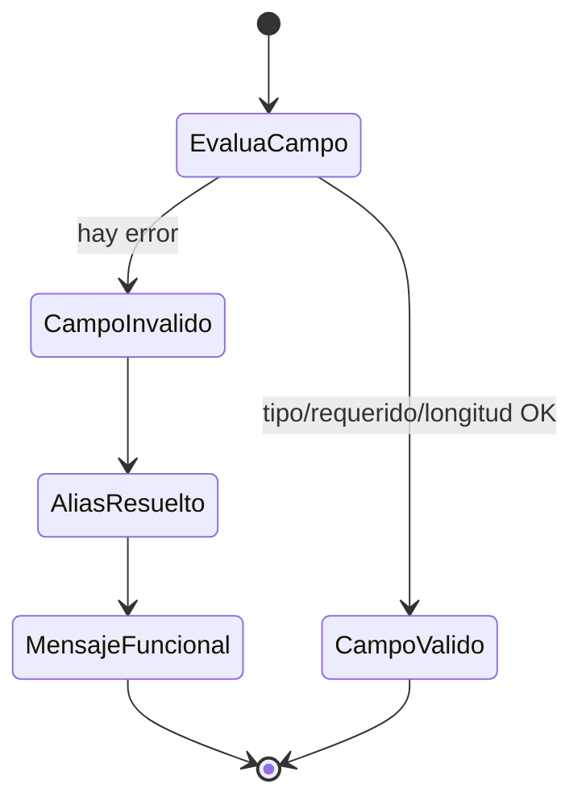

# Diagrama de Estado - SCRUM-52

```mermaid
stateDiagram-v2
    [*] --> EvaluaCampo
    EvaluaCampo --> CampoValido: tipo/requerido/longitud OK
    EvaluaCampo --> CampoInvalido: hay error
    CampoInvalido --> AliasResuelto
    AliasResuelto --> MensajeFuncional
    MensajeFuncional --> [*]
    CampoValido --> [*]
```
