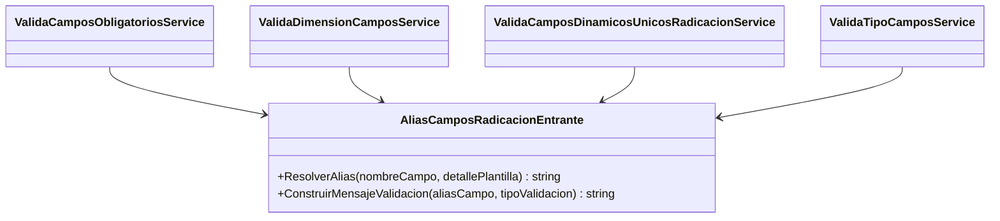

# Diagrama de Clases - SCRUM-53

```mermaid
classDiagram
    class AliasCamposRadicacionEntrante {
      +ResolverAlias(nombreCampo, detallePlantilla) string
      +ConstruirMensajeValidacion(aliasCampo, tipoValidacion) string
    }
    class ValidaCamposObligatoriosService
    class ValidaDimensionCamposService
    class ValidaCamposDinamicosUnicosRadicacionService
    class ValidaTipoCamposService

    ValidaCamposObligatoriosService --> AliasCamposRadicacionEntrante
    ValidaDimensionCamposService --> AliasCamposRadicacionEntrante
    ValidaCamposDinamicosUnicosRadicacionService --> AliasCamposRadicacionEntrante
    ValidaTipoCamposService --> AliasCamposRadicacionEntrante
```
