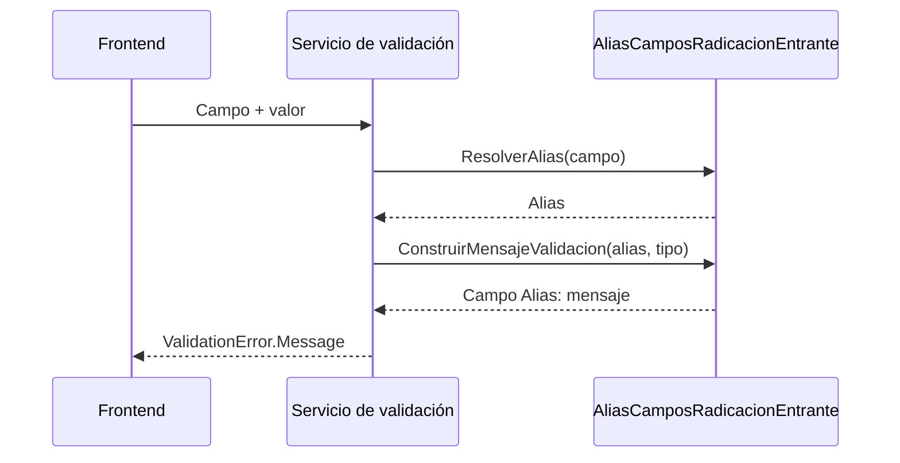

# Diagrama de Secuencia - SCRUM-53

```mermaid
sequenceDiagram
    participant FE as Frontend
    participant VAL as Servicio de validación
    participant ALS as AliasCamposRadicacionEntrante

    FE->>VAL: Campo + valor
    VAL->>ALS: ResolverAlias(campo)
    ALS-->>VAL: Alias
    VAL->>ALS: ConstruirMensajeValidacion(alias, tipo)
    ALS-->>VAL: Campo Alias: mensaje
    VAL-->>FE: ValidationError.Message
```
