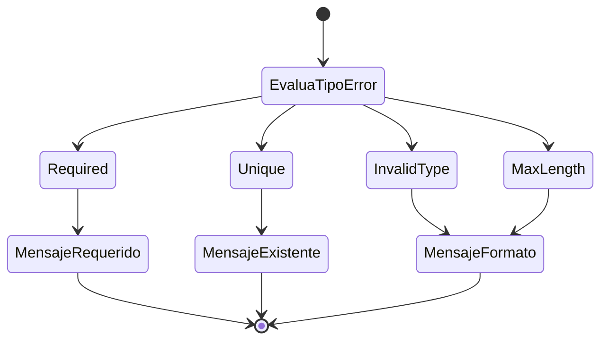

# Diagrama de Estado - SCRUM-53

```mermaid
stateDiagram-v2
    [*] --> EvaluaTipoError
    EvaluaTipoError --> Required
    EvaluaTipoError --> Unique
    EvaluaTipoError --> InvalidType
    EvaluaTipoError --> MaxLength
    Required --> MensajeRequerido
    Unique --> MensajeExistente
    InvalidType --> MensajeFormato
    MaxLength --> MensajeFormato
    MensajeRequerido --> [*]
    MensajeExistente --> [*]
    MensajeFormato --> [*]
```
