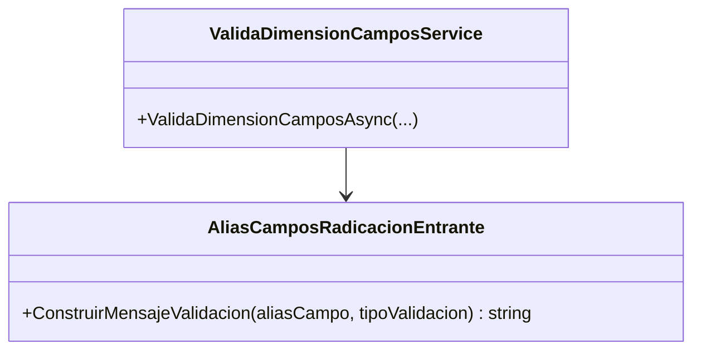

# Diagrama de Clases - SCRUM-54

```mermaid
classDiagram
    class AliasCamposRadicacionEntrante {
      +ConstruirMensajeValidacion(aliasCampo, tipoValidacion) string
    }

    class ValidaDimensionCamposService {
      +ValidaDimensionCamposAsync(...)
    }

    ValidaDimensionCamposService --> AliasCamposRadicacionEntrante
```
