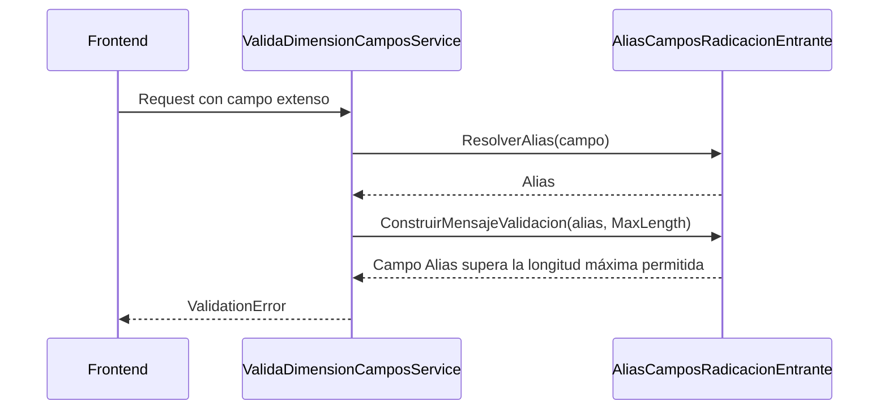

# Diagrama de Secuencia - SCRUM-54

```mermaid
sequenceDiagram
    participant FE as Frontend
    participant DIM as ValidaDimensionCamposService
    participant ALS as AliasCamposRadicacionEntrante

    FE->>DIM: Request con campo extenso
    DIM->>ALS: ResolverAlias(campo)
    ALS-->>DIM: Alias
    DIM->>ALS: ConstruirMensajeValidacion(alias, MaxLength)
    ALS-->>DIM: Campo Alias supera la longitud máxima permitida
    DIM-->>FE: ValidationError
```
