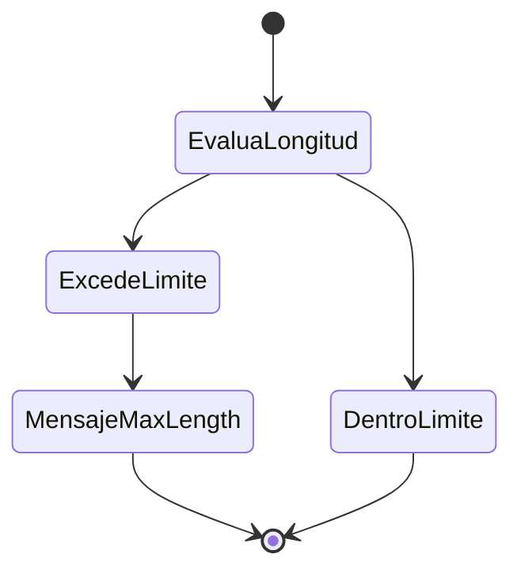

# Diagrama de Estado - SCRUM-54

```mermaid
stateDiagram-v2
    [*] --> EvaluaLongitud
    EvaluaLongitud --> DentroLimite
    EvaluaLongitud --> ExcedeLimite
    ExcedeLimite --> MensajeMaxLength
    MensajeMaxLength --> [*]
    DentroLimite --> [*]
```
