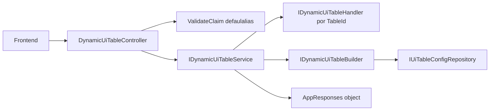
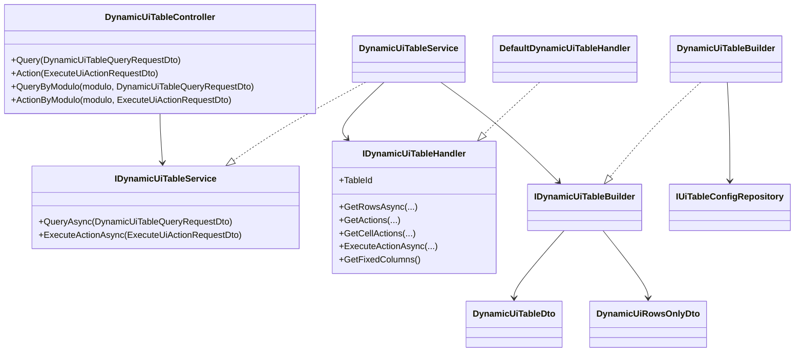
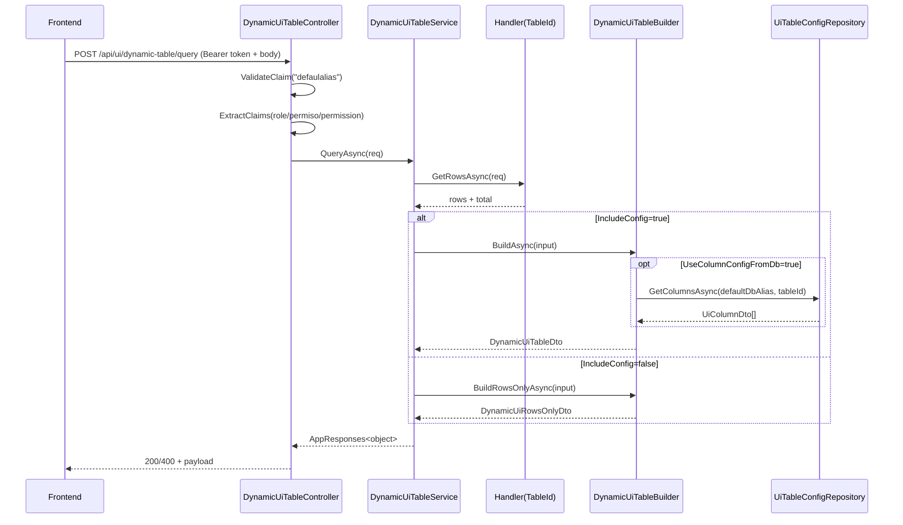
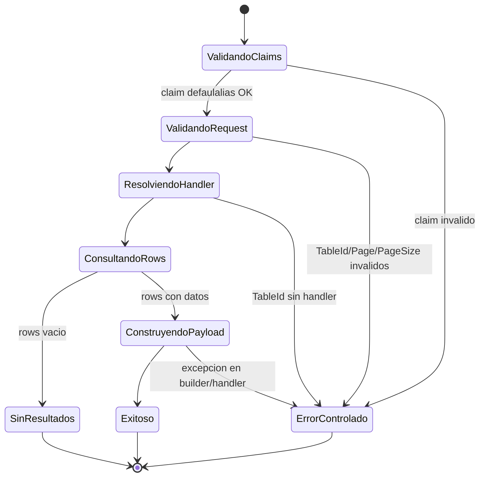

# SCRUM-34 - Diagramas de Analisis (Reubicado en SCRUM-35)

> Documento movido desde `Docs/Radicacion/Tramite` a `Docs/UI/MuiTable` como parte del ticket SCRUM-35.

## Caso de uso

## Diagrama de clases

## Diagrama de secuencia (query)

## Diagrama de estado

