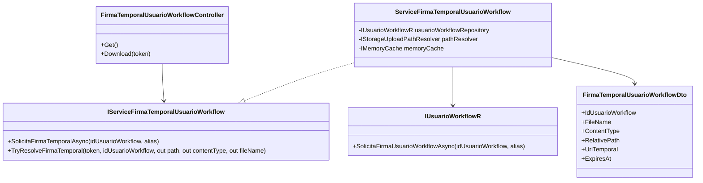
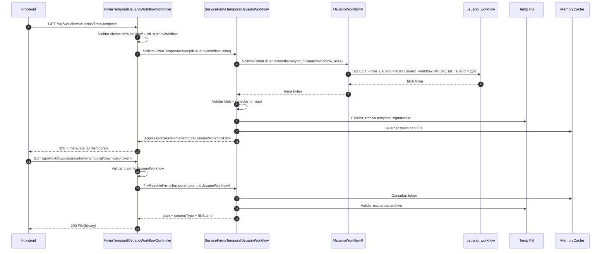
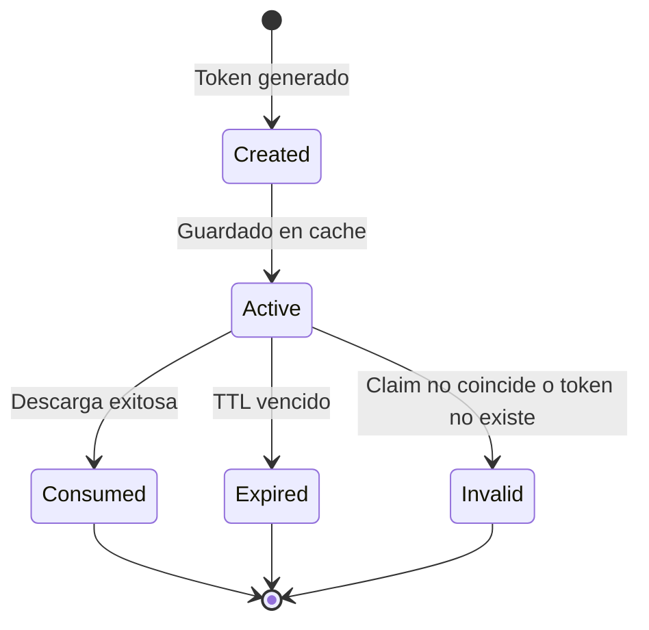
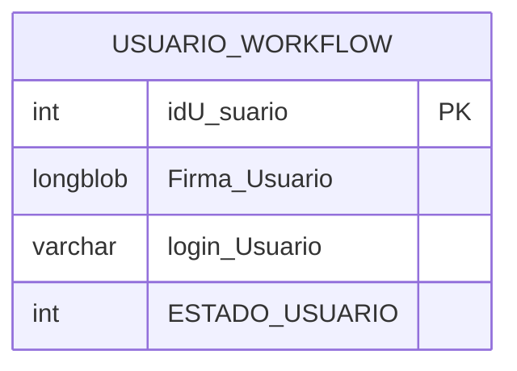

# SCRUM-201 - Arquitectura API Firma Temporal Usuario Workflow

## 1. Objetivo
Exponer una API segura para que el frontend obtenga la firma del usuario workflow desde `usuario_workflow.Firma_Usuario` como recurso temporal descargable.

## 2. Alcance
- Endpoint de generación de recurso temporal.
- Endpoint de descarga binaria por token temporal.
- Seguridad por claims workflow (`defaulaliaswf`, `IdUsuarioWorkflow`).
- Sin exponer blob ni path físico absoluto.

## 3. Componentes y responsabilidades

## 3.1 Controller
`DocuArchi.Api/Controllers/Workflow/UsuarioWorkflow/FirmaTemporalUsuarioWorkflowController.cs`
- Validar claims.
- Orquestar service.
- Retornar `AppResponses<T>` en endpoint de metadata.
- Retornar `File(...)` en endpoint de descarga.

## 3.2 Service
`MiApp.Services/Service/Workflow/Usuario/ServiceFirmaTemporalUsuarioWorkflow.cs`
- Validar reglas de negocio.
- Consultar firma en repositorio.
- Detectar formato de imagen.
- Escribir temporal en disco.
- Generar token temporal y TTL en cache memoria.
- Resolver token para descarga.

## 3.3 Repository
`MiApp.Repository/Repositorio/Workflow/usuario/UsuarioWorkflowR.cs`
- Consultar `Firma_Usuario` por `idU_suario` con `defaultDbAlias`.
- Usar `QueryOptions` + `DapperCrudEngine`.

## 3.4 DTO
`MiApp.DTOs/DTOs/Workflow/Usuario/FirmaTemporalUsuarioWorkflowDto.cs`
- Contrato de salida para frontend.

## 4. Diagrama de clases

## 5. Diagrama de secuencia (metadata + descarga)

## 6. Diagrama de estados del token temporal

## 7. Contratos y reglas de seguridad
- Claim `defaulaliaswf`: obligatorio para seleccionar alias de conexión workflow.
- Claim `IdUsuarioWorkflow`: obligatorio para consulta y autorización de descarga.
- No se permite obtener firma de otro usuario alterando parámetros.
- El token temporal no es persistente en DB; vive en memoria con TTL.

## 8. Depuración operativa
- Si falla metadata:
  - validar claims en JWT (`defaulaliaswf`, `IdUsuarioWorkflow`)
  - validar firma existente en `usuario_workflow.Firma_Usuario`
- Si falla descarga:
  - validar `token` vigente (TTL)
  - validar que el archivo temporal exista
  - validar que `IdUsuarioWorkflow` del claim coincida con el registro cacheado

## 9. Tablas/almacenamientos relacionados

## 9.1 Modelo de datos persistente

## 9.2 Almacenamiento temporal (no persistente)
- Root temporal: `StorageUploadPathResolver.GetTempRoot()`
- Carpeta funcional: `signatures`
- Cache en memoria:
  - key: `workflow-signature:{token}`
  - value: path + contentType + fileName + idUsuarioWorkflow + expiresAt
