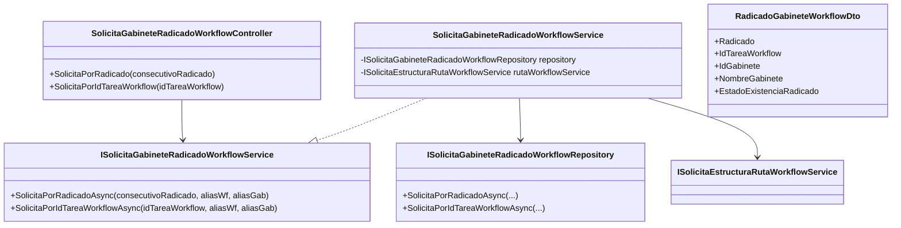

# SCRUM-207 - Arquitectura API Gabinete Workflow

## 1. Objetivo
Exponer una API segura para resolver el gabinete asociado a un documento workflow consultando por:

1. `consecutivoRadicado`
2. `idTareaWorkflow`

## 2. Alcance
- Nuevos endpoints en módulo workflow/ruta-trabajo.
- Resolución interna de `Nombre_Ruta` (sin exponerlo a frontend).
- Lectura de tabla dinámica `dat_adic_tar{Nombre_Ruta}`.
- Resolución de `Nombre_Gabinete` en `configuracion_gabinete`.
- Contrato unificado `AppResponses<RadicadoGabineteWorkflowDto>`.

## 3. Componentes y responsabilidades

## 3.1 Controller
`DocuArchi.Api/Controllers/Radicacion/Tramite/SolicitaGabineteRadicadoWorkflowController.cs`
- Valida claim `defaulaliaswf`.
- Obtiene claim opcional `defaulalias` por compatibilidad.
- Orquesta llamadas al service.
- Retorna `Ok`/`BadRequest` con contrato controlado.

## 3.2 Service
`MiApp.Services/Service/Workflow/RutaTrabajo/SolicitaGabineteRadicadoWorkflowService.cs`
- Resuelve ruta activa desde `ISolicitaEstructuraRutaWorkflowService`.
- Valida `Nombre_Ruta` con regex `^[A-Za-z0-9_]+$`.
- Define alias de gabinete usando siempre alias workflow (`defaulaliaswf`).
- Invoca repositorio y normaliza fallback de salida.

## 3.3 Repository
`MiApp.Repository/Repositorio/Workflow/RutaTrabajo/SolicitaGabineteRadicadoWorkflowRepository.cs`
- Consulta por `RADICADO` en `dat_adic_tar{ruta}`.
- Consulta por `INICIO_TAREAS_WORKFLOW_ID_TAREA` en `dat_adic_tar{ruta}`.
- Consulta `Nombre_Gabinete` por `id_Gabinete`.
- Si existe fila workflow (`EstadoExistenciaRadicado=YES`) y `NombreGabinete` no se resuelve, retorna `success=false`.
- Usa `QueryOptions + DapperCrudEngine`.

## 3.4 DTO y modelo
- DTO: `MiApp.DTOs/DTOs/Workflow/RutaTrabajo/RadicadoGabineteWorkflowDto.cs`
- Modelo interno: `MiApp.Models/Models/Workflow/RutaTrabajo/RadicadoGabineteWorkflow.cs`

## 4. Diagrama de clases

## 5. Seguridad y validaciones
1. `defaulaliaswf` obligatorio.
2. `Nombre_Ruta` validado por regex estricta.
3. Frontend no puede inyectar nombre de tabla dinámica.
4. Consultas parametrizadas por `QueryOptions`.
5. Funciones de controller/service/repository con `try/catch`.

## 6. Reglas de alias
1. Workflow: usa `defaulaliaswf`.
2. Gabinete: usa `defaulaliaswf` (misma base workflow para `configuracion_gabinete`).

## 7. Compatibilidad
- No modifica contrato ni comportamiento de:
  - `SolicitaExistenciaRadicadoRutaWorkflow`.
