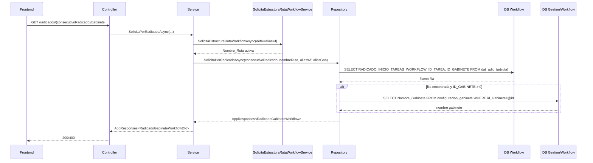
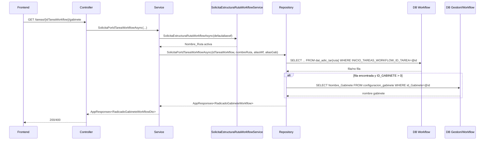

# SCRUM-207 - Diagramas

## Secuencia Por Radicado

```mermaid
sequenceDiagram
    participant FE as Frontend
    participant API as Controller
    participant SVC as Service
    participant RUTA as SolicitaEstructuraRutaWorkflowService
    participant REP as Repository
    participant DBWF as DB Workflow
    participant DBGD as DB Gestion/Workflow

    FE->>API: GET /radicados/{consecutivoRadicado}/gabinete
    API->>SVC: SolicitaPorRadicadoAsync(...)
    SVC->>RUTA: SolicitaEstructuraRutaWorkflowAsync(defaulaliaswf)
    RUTA-->>SVC: Nombre_Ruta activa
    SVC->>REP: SolicitaPorRadicadoAsync(consecutivoRadicado, nombreRuta, aliasWf, aliasGab)
    REP->>DBWF: SELECT RADICADO, INICIO_TAREAS_WORKFLOW_ID_TAREA, ID_GABINETE FROM dat_adic_tar{ruta}
    DBWF-->>REP: fila/no fila
    alt fila encontrada y ID_GABINETE > 0
        REP->>DBGD: SELECT Nombre_Gabinete FROM configuracion_gabinete WHERE id_Gabinete=@id
        DBGD-->>REP: nombre gabinete
    end
    REP-->>SVC: AppResponses<RadicadoGabineteWorkflow>
    SVC-->>API: AppResponses<RadicadoGabineteWorkflowDto>
    API-->>FE: 200/400
```

## Secuencia Por IdTareaWorkflow

```mermaid
sequenceDiagram
    participant FE as Frontend
    participant API as Controller
    participant SVC as Service
    participant RUTA as SolicitaEstructuraRutaWorkflowService
    participant REP as Repository
    participant DBWF as DB Workflow
    participant DBGD as DB Gestion/Workflow

    FE->>API: GET /tareas/{idTareaWorkflow}/gabinete
    API->>SVC: SolicitaPorIdTareaWorkflowAsync(...)
    SVC->>RUTA: SolicitaEstructuraRutaWorkflowAsync(defaulaliaswf)
    RUTA-->>SVC: Nombre_Ruta activa
    SVC->>REP: SolicitaPorIdTareaWorkflowAsync(idTareaWorkflow, nombreRuta, aliasWf, aliasGab)
    REP->>DBWF: SELECT ... FROM dat_adic_tar{ruta} WHERE INICIO_TAREAS_WORKFLOW_ID_TAREA=@id
    DBWF-->>REP: fila/no fila
    alt fila encontrada y ID_GABINETE > 0
        REP->>DBGD: SELECT Nombre_Gabinete FROM configuracion_gabinete WHERE id_Gabinete=@id
        DBGD-->>REP: nombre gabinete
    end
    REP-->>SVC: AppResponses<RadicadoGabineteWorkflow>
    SVC-->>API: AppResponses<RadicadoGabineteWorkflowDto>
    API-->>FE: 200/400
```

