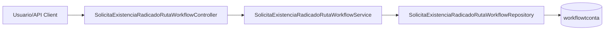
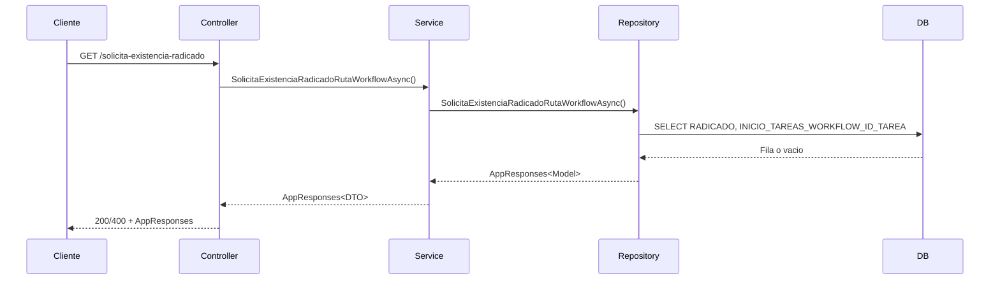

# SCRUM-62 - Diagramas

## Caso de uso

```mermaid
flowchart LR
    U[Usuario/API Client] --> C[SolicitaExistenciaRadicadoRutaWorkflowController]
    C --> S[SolicitaExistenciaRadicadoRutaWorkflowService]
    S --> R[SolicitaExistenciaRadicadoRutaWorkflowRepository]
    R --> DB[(workflowtconta)]
```

## Secuencia

```mermaid
sequenceDiagram
    participant U as Cliente
    participant C as Controller
    participant S as Service
    participant R as Repository
    participant DB as DB

    U->>C: GET /solicita-existencia-radicado
    C->>S: SolicitaExistenciaRadicadoRutaWorkflowAsync()
    S->>R: SolicitaExistenciaRadicadoRutaWorkflowAsync()
    R->>DB: SELECT RADICADO, INICIO_TAREAS_WORKFLOW_ID_TAREA
    DB-->>R: Fila o vacio
    R-->>S: AppResponses<Model>
    S-->>C: AppResponses<DTO>
    C-->>U: 200/400 + AppResponses
```
